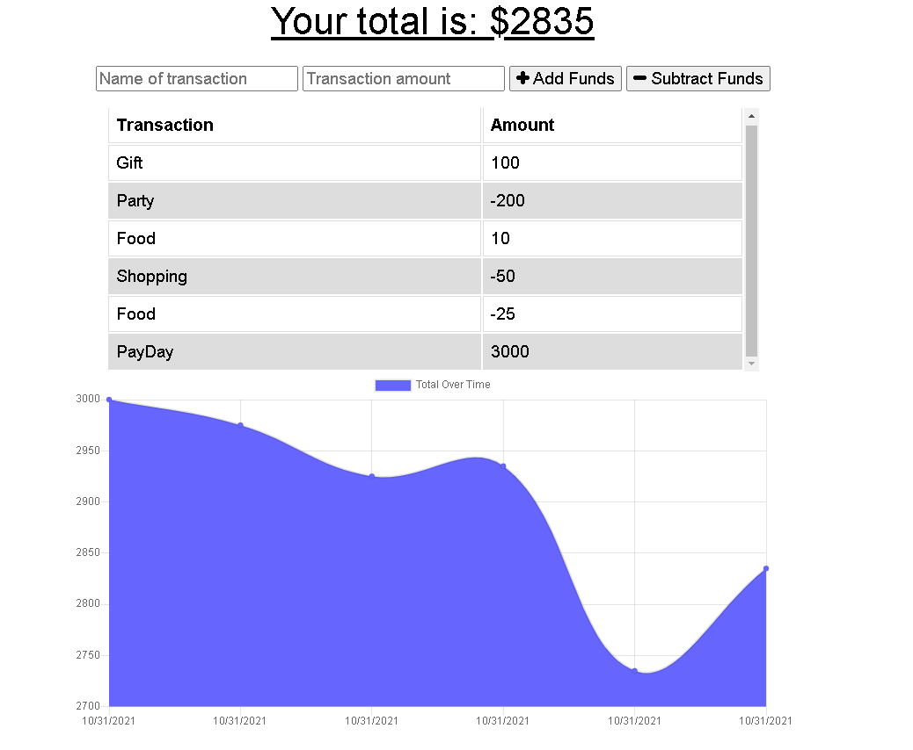
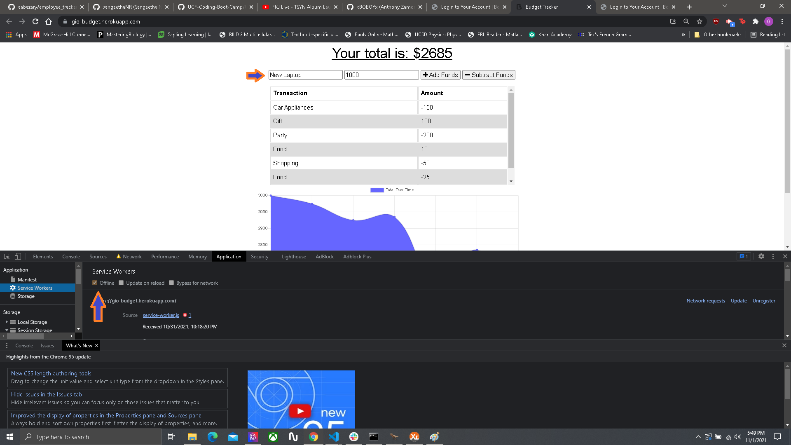
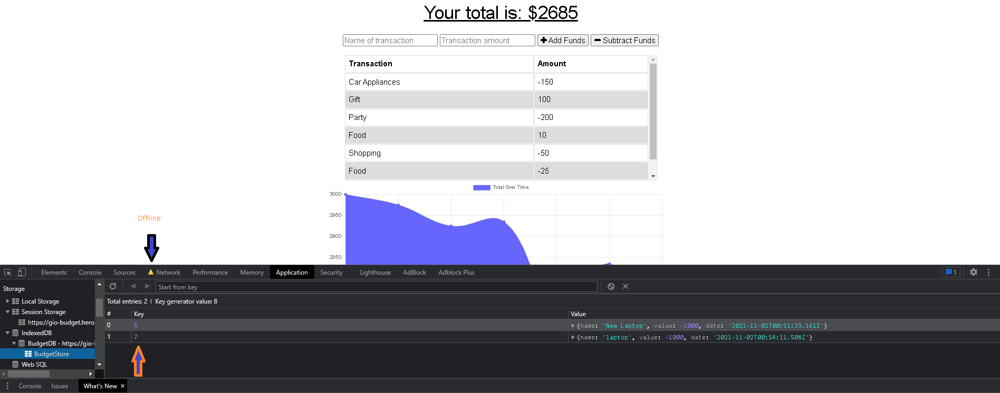
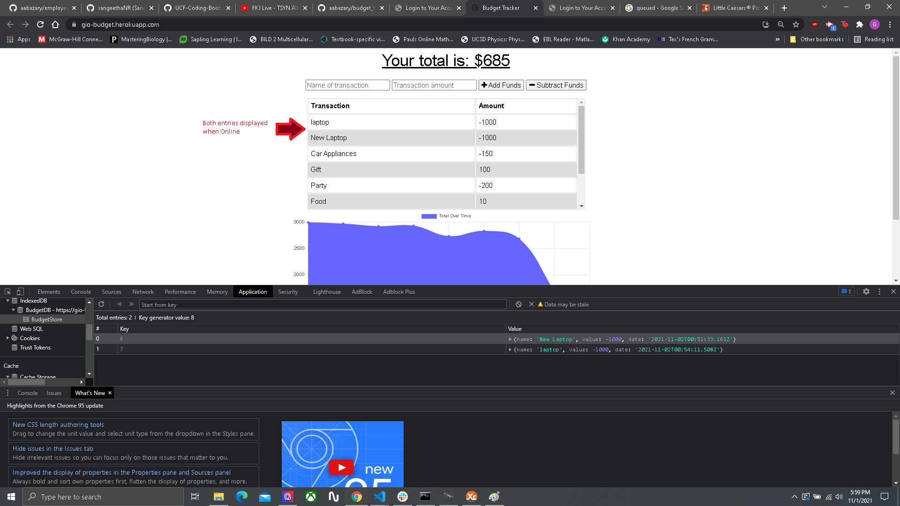

# BudgetTrackerGio-PWA


## Description
This app is a Budget Tracker with offline capability and access. The user will be able to enter costs and deposits into their budget whether or not they have access to the internet. When transactions are entered offline and then brought back online, the total should display.

## Table of contents

* [Description](#description)
* [Installation](#installation)
* [Usage Information](#usage)
* [License](#license) 
* [Contribution](#contribution)
* [GitHub Repo and Heroku Application](#GitHub)
* [Images/Videos](#Images)
* [Contact Info](#questions)

## Installation
1. Clone Repo to your computer
2. Run the following command for proper installation of dependencies:
```
    npm install
```


## Usage Information
The first step is to open the indicated file (server.js) in an integrated terminal. 
Using Node.js, we use the following command:
```
npm start
```


## License


This Project is licensed under [MIT](https://opensource.org/licenses/MIT)

## Contribution Guidelines
Thanks to:
* [https://developers.google.com/web/fundamentals/primers/service-workers](https://developers.google.com/web/fundamentals/primers/service-workers)
* [https://developer.mozilla.org/en-US/docs/Web/API/IDBFactory](https://developer.mozilla.org/en-US/docs/Web/API/IDBFactory)
* [https://developer.mozilla.org/en-US/docs/Web/API/IndexedDB_API/Using_IndexedDB](https://developer.mozilla.org/en-US/docs/Web/API/IndexedDB_API/Using_IndexedDB)

## GitHub Repo and Heroku Application
* [https://github.com/gisosa531/BudgetTrackerGio-PWA](https://github.com/gisosa531/BudgetTrackerGio-PWA)

* [https://gio-budget.herokuapp.com/](https://gio-budget.herokuapp.com/)

## Images
Home Page:
This is the page when accessing the site.


Offline Mode: 
We are able to verify and add items while offline by toggling on Offline mode in the application section of the console log. We can then input items while being Offline.



Two Entries Queued:
The entries will be queued and displayed in the indexed database while online. In order to have them displayed and optimized with the existing data, we have to toggle back online and refresh.



Online Mode:
The information will then be displayed with the existing transactions. 



## Contact Information
If you have any problems concerning the repo, please file an issue or email me at 
gio53196@gmail.com
The link to my work repositories is 
[Github Profile](https://github.com/gisosa531/).